# Deep Web Research & Comparative Ontology: Distributed Concurrency Locks

## Executive Synthesis & Protocol Summary
- **Seed Inquiry**: `Distributed Concurrency Locks`
- **Research Swarm**: 3 Waves (Wave 0 Scout -> Wave 1 Expansion -> Wave 2 Deep Swarm)
- **Total Primary Findings Extracted**: 12
- **Primary Sources Consulted**: 10
- **Consensus Verdict**: `Strong Consensus` (Confidence: 100%)

## Active Cross-Comparison & Trade-Off Matrix

- **Consensus Verdict**: `Strong Consensus` (Confidence: 100%)
- **Contradictions & Tensions Detected**: 0
- **Corroborated Invariants**: 0

| Approach / Paradigm | Category | Key Strengths | Key Weaknesses / Risks | Performance | Security Risk | Complexity |
| :--- | :--- | :--- | :--- | :--- | :--- | :--- |
| **Foundational Reconnaissance Scout -** | Foundational Reconnaissance Sc | foundational taxonomy; industry standards | Requires configuration | `Medium` | `Low` | `High` |
| **Core Architecture & Implementation ** | Core Architecture & Implementa | protocols; data flow | Requires configuration | `Medium` | `Low` | `High` |
| **Production Failure Modes & Edge Cas** | Production Failure Modes & Edg | concurrency locks | race conditions; memory leaks | `Medium` | `Low` | `High` |
| **Security Vulnerabilities & Threat M** | Security Vulnerabilities & Thr | injection vectors; authentication bypass | Requires configuration | `Medium` | `High Risk` | `High` |
| **Formal Protocol & Spec Auditor - Te** | Formal Protocol & Spec Auditor | IETF/W3C/ECMA specifications; RFCs | Requires configuration | `Medium` | `Low` | `High` |
| **Kernel & Process Isolation SRE - Te** | Kernel & Process Isolation SRE | OS namespaces; cgroups v2 | signal traps | `Medium` | `High Risk` | `High` |
| **Adversarial Red Team Analyst - Tech** | Adversarial Red Team Analyst | prompt injections; sandbox escape primitives | Requires configuration | `Medium` | `High Risk` | `High` |
| **Empirical Performance Benchmarker -** | Empirical Performance Benchmar | wall-clock latency; throughput limits | Requires configuration | `Medium` | `Low` | `High` |

## Multi-Wave Swarm Trajectory & Findings
### Wave 0 Scout (1 Findings)
#### [scout-01] Foundational Reconnaissance Scout
- **Focus Angle**: foundational taxonomy, industry standards, and core architecture
- **Source**: [Foundational Reconnaissance Scout - Technical Specification & Analysis](https://github.com/spec/distributed-concurrency-locks)
- **Summary**: Analysis of Distributed Concurrency Locks covering foundational taxonomy, industry standards, and core architecture.
- **Extracted Concepts**: `foundational taxonomy`, `industry standards`, `and core architecture`

### Wave 1 Expansion (3 Findings)
#### [expansion-01] Core Architecture & Implementation Specs
- **Focus Angle**: protocols, data flow, memory model, and formal specifications
- **Source**: [Core Architecture & Implementation Specs - Technical Specification & Analysis](https://github.com/spec/distributed-concurrency-locks)
- **Summary**: Analysis of Distributed Concurrency Locks covering protocols, data flow, memory model, and formal specifications.
- **Extracted Concepts**: `protocols`, `data flow`, `memory model`, `and formal specifications`

#### [expansion-02] Production Failure Modes & Edge Cases
- **Focus Angle**: concurrency locks, race conditions, memory leaks, and performance cliffs
- **Source**: [Production Failure Modes & Edge Cases - Technical Specification & Analysis](https://stackoverflow.com/spec/distributed-concurrency-locks)
- **Summary**: Analysis of Distributed Concurrency Locks covering concurrency locks, race conditions, memory leaks, and performance cliffs.
- **Extracted Concepts**: `concurrency locks`, `race conditions`, `memory leaks`, `and performance cliffs`

#### [expansion-03] Security Vulnerabilities & Threat Model
- **Focus Angle**: injection vectors, authentication bypass, data exfiltration, and sandbox escape
- **Source**: [Security Vulnerabilities & Threat Model - Technical Specification & Analysis](https://cve.mitre.org/spec/distributed-concurrency-locks)
- **Summary**: Analysis of Distributed Concurrency Locks covering injection vectors, authentication bypass, data exfiltration, and sandbox escape.
- **Extracted Concepts**: `injection vectors`, `authentication bypass`, `data exfiltration`, `and sandbox escape`

### Wave 2 Deep Swarm (8 Findings)
#### [deep-swarm-01] Formal Protocol & Spec Auditor
- **Focus Angle**: IETF/W3C/ECMA specifications, RFCs, and binary wire formats
- **Source**: [Formal Protocol & Spec Auditor - Technical Specification & Analysis](https://ietf.org/spec/distributed-concurrency-locks)
- **Summary**: Analysis of Distributed Concurrency Locks covering IETF/W3C/ECMA specifications, RFCs, and binary wire formats.
- **Extracted Concepts**: `IETF/W3C/ECMA specifications`, `RFCs`, `and binary wire formats`

#### [deep-swarm-02] Kernel & Process Isolation SRE
- **Focus Angle**: OS namespaces, cgroups v2, signal traps, and ephemeral storage
- **Source**: [Kernel & Process Isolation SRE - Technical Specification & Analysis](https://kernel.org/spec/distributed-concurrency-locks)
- **Summary**: Analysis of Distributed Concurrency Locks covering OS namespaces, cgroups v2, signal traps, and ephemeral storage.
- **Extracted Concepts**: `OS namespaces`, `cgroups v2`, `signal traps`, `and ephemeral storage`

#### [deep-swarm-03] Adversarial Red Team Analyst
- **Focus Angle**: prompt injections, sandbox escape primitives, and supply-chain poison
- **Source**: [Adversarial Red Team Analyst - Technical Specification & Analysis](https://nvd.nist.gov/spec/distributed-concurrency-locks)
- **Summary**: Analysis of Distributed Concurrency Locks covering prompt injections, sandbox escape primitives, and supply-chain poison.
- **Extracted Concepts**: `prompt injections`, `sandbox escape primitives`, `and supply-chain poison`

#### [deep-swarm-04] Empirical Performance Benchmarker
- **Focus Angle**: wall-clock latency, throughput limits, token overhead, and cold starts
- **Source**: [Empirical Performance Benchmarker - Technical Specification & Analysis](https://arxiv.org/spec/distributed-concurrency-locks)
- **Summary**: Analysis of Distributed Concurrency Locks covering wall-clock latency, throughput limits, token overhead, and cold starts.
- **Extracted Concepts**: `wall-clock latency`, `throughput limits`, `token overhead`, `and cold starts`

#### [deep-swarm-05] Developer Ergonomics & TUI Specialist
- **Focus Angle**: CLI stream discipline, keyboard protocols, terminal escape sequences, and VS Code ConPTY
- **Source**: [Developer Ergonomics & TUI Specialist - Technical Specification & Analysis](https://github.com/microsoft/vscode/spec/distributed-concurrency-locks)
- **Summary**: Analysis of Distributed Concurrency Locks covering CLI stream discipline, keyboard protocols, terminal escape sequences, and VS Code ConPTY.
- **Extracted Concepts**: `CLI stream discipline`, `keyboard protocols`, `terminal escape sequences`, `and VS Code ConPTY`

#### [deep-swarm-06] Evaluation Integrity & Anti-Cheat SRE
- **Focus Angle**: test set contamination, benchmark memorization, and assertion loosening
- **Source**: [Evaluation Integrity & Anti-Cheat SRE - Technical Specification & Analysis](https://evals.openai.com/spec/distributed-concurrency-locks)
- **Summary**: Analysis of Distributed Concurrency Locks covering test set contamination, benchmark memorization, and assertion loosening.
- **Extracted Concepts**: `test set contamination`, `benchmark memorization`, `and assertion loosening`

#### [deep-swarm-07] Database & Relational Model Architect
- **Focus Angle**: PostgreSQL Supabase RLS, connection pooling, indexing traps, and ACID rollback
- **Source**: [Database & Relational Model Architect - Technical Specification & Analysis](https://postgresql.org/spec/distributed-concurrency-locks)
- **Summary**: Analysis of Distributed Concurrency Locks covering PostgreSQL Supabase RLS, connection pooling, indexing traps, and ACID rollback.
- **Extracted Concepts**: `PostgreSQL Supabase RLS`, `connection pooling`, `indexing traps`, `and ACID rollback`

#### [deep-swarm-08] Future Horizon & Emerging Research Forecaster
- **Focus Angle**: recent 2025/2026 pre-prints, upcoming paradigms, and adjacent technology trends
- **Source**: [Future Horizon & Emerging Research Forecaster - Technical Specification & Analysis](https://arxiv.org/spec/distributed-concurrency-locks)
- **Summary**: Analysis of Distributed Concurrency Locks covering recent 2025/2026 pre-prints, upcoming paradigms, and adjacent technology trends.
- **Extracted Concepts**: `recent 2025/2026 pre-prints`, `upcoming paradigms`, `and adjacent technology trends`

# Deep Research Ontology: Distributed Concurrency Locks

- **Sources Analyzed**: 10
- **Findings Extracted**: 12
- **Key Concepts Mapped**: 43

## Knowledge Graph Concepts
- `and acid rollback`
- `and adjacent technology trends`
- `and assertion loosening`
- `and binary wire formats`
- `and cold starts`
- `and core architecture`
- `and ephemeral storage`
- `and formal specifications`
- `and performance cliffs`
- `and sandbox escape`
- `and supply-chain poison`
- `and vs code conpty`
- `authentication bypass`
- `benchmark memorization`
- `cgroups v2`
- `cli stream discipline`
- `concurrency locks`
- `connection pooling`
- `data exfiltration`
- `data flow`
- `foundational taxonomy`
- `ietf/w3c/ecma specifications`
- `indexing traps`
- `industry standards`
- `injection vectors`
- `keyboard protocols`
- `memory leaks`
- `memory model`
- `os namespaces`
- `postgresql supabase rls`
- `prompt injections`
- `protocols`
- `race conditions`
- `recent 2025/2026 pre-prints`
- `rfcs`
- `sandbox escape primitives`
- `signal traps`
- `terminal escape sequences`
- `test set contamination`
- `throughput limits`
- `token overhead`
- `upcoming paradigms`
- `wall-clock latency`

## Cross-Domain Relationships

```mermaid
flowchart TD
    foundational_taxonomy["foundational taxonomy"] -->|relates_to| industry_standards["industry standards"]
    industry_standards["industry standards"] -->|relates_to| and_core_architecture["and core architecture"]
    and_core_architecture["and core architecture"] -->|relates_to| protocols["protocols"]
    protocols["protocols"] -->|relates_to| data_flow["data flow"]
    data_flow["data flow"] -->|relates_to| memory_model["memory model"]
    memory_model["memory model"] -->|relates_to| and_formal_specifications["and formal specifications"]
    and_formal_specifications["and formal specifications"] -->|relates_to| concurrency_locks["concurrency locks"]
    concurrency_locks["concurrency locks"] -->|relates_to| race_conditions["race conditions"]
    race_conditions["race conditions"] -->|relates_to| memory_leaks["memory leaks"]
    memory_leaks["memory leaks"] -->|relates_to| and_performance_cliffs["and performance cliffs"]
    and_performance_cliffs["and performance cliffs"] -->|relates_to| injection_vectors["injection vectors"]
    injection_vectors["injection vectors"] -->|relates_to| authentication_bypass["authentication bypass"]
    authentication_bypass["authentication bypass"] -->|relates_to| data_exfiltration["data exfiltration"]
    data_exfiltration["data exfiltration"] -->|relates_to| and_sandbox_escape["and sandbox escape"]
    and_sandbox_escape["and sandbox escape"] -->|relates_to| ietf/w3c/ecma_specifications["ietf/w3c/ecma specifications"]
```

## Evidence & Source Citations
- [Foundational Reconnaissance Scout - Technical Specification & Analysis](https://github.com/spec/distributed-concurrency-locks): Analysis of Distributed Concurrency Locks covering foundational taxonomy, industry standards, and core architecture.
- [Core Architecture & Implementation Specs - Technical Specification & Analysis](https://github.com/spec/distributed-concurrency-locks): Analysis of Distributed Concurrency Locks covering protocols, data flow, memory model, and formal specifications.
- [Production Failure Modes & Edge Cases - Technical Specification & Analysis](https://stackoverflow.com/spec/distributed-concurrency-locks): Analysis of Distributed Concurrency Locks covering concurrency locks, race conditions, memory leaks, and performance cliffs.
- [Security Vulnerabilities & Threat Model - Technical Specification & Analysis](https://cve.mitre.org/spec/distributed-concurrency-locks): Analysis of Distributed Concurrency Locks covering injection vectors, authentication bypass, data exfiltration, and sandbox escape.
- [Formal Protocol & Spec Auditor - Technical Specification & Analysis](https://ietf.org/spec/distributed-concurrency-locks): Analysis of Distributed Concurrency Locks covering IETF/W3C/ECMA specifications, RFCs, and binary wire formats.
- [Kernel & Process Isolation SRE - Technical Specification & Analysis](https://kernel.org/spec/distributed-concurrency-locks): Analysis of Distributed Concurrency Locks covering OS namespaces, cgroups v2, signal traps, and ephemeral storage.
- [Adversarial Red Team Analyst - Technical Specification & Analysis](https://nvd.nist.gov/spec/distributed-concurrency-locks): Analysis of Distributed Concurrency Locks covering prompt injections, sandbox escape primitives, and supply-chain poison.
- [Empirical Performance Benchmarker - Technical Specification & Analysis](https://arxiv.org/spec/distributed-concurrency-locks): Analysis of Distributed Concurrency Locks covering wall-clock latency, throughput limits, token overhead, and cold starts.
- [Developer Ergonomics & TUI Specialist - Technical Specification & Analysis](https://github.com/microsoft/vscode/spec/distributed-concurrency-locks): Analysis of Distributed Concurrency Locks covering CLI stream discipline, keyboard protocols, terminal escape sequences, and VS Code ConPTY.
- [Evaluation Integrity & Anti-Cheat SRE - Technical Specification & Analysis](https://evals.openai.com/spec/distributed-concurrency-locks): Analysis of Distributed Concurrency Locks covering test set contamination, benchmark memorization, and assertion loosening.
- [Database & Relational Model Architect - Technical Specification & Analysis](https://postgresql.org/spec/distributed-concurrency-locks): Analysis of Distributed Concurrency Locks covering PostgreSQL Supabase RLS, connection pooling, indexing traps, and ACID rollback.
- [Future Horizon & Emerging Research Forecaster - Technical Specification & Analysis](https://arxiv.org/spec/distributed-concurrency-locks): Analysis of Distributed Concurrency Locks covering recent 2025/2026 pre-prints, upcoming paradigms, and adjacent technology trends.