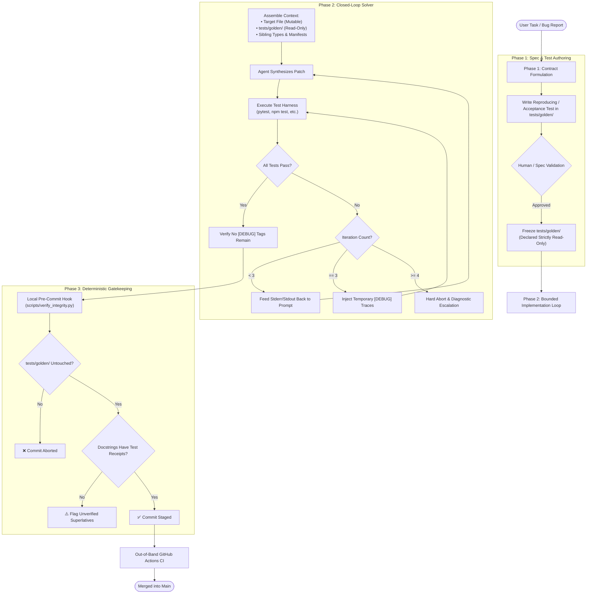

# MinusCorrect: Architectural Specification & System Mechanics

> A formal breakdown of the architectural design, control loops, and verification boundaries of the MinusCorrect protocol.

---

## 1. Core Engineering Thesis

Modern Large Language Models (LLMs) excel at probabilistic text generation, but software engineering is deterministic physics. When autonomous coding agents (Claude Code, Antigravity, OpenAI Codex, Cursor) operate on production codebases without rigorous boundaries, they naturally seek the **path of least resistance** to satisfy their exit conditions.

### The Failure Modes of Unbounded Agent Autonomy
```
Unbounded Autonomous Agent
   ├── Downstream Symptom Masking (swallowing exceptions with try/except: pass)
   ├── Magic Constant Injection (arbitrary sleep() to bypass async race conditions)
   ├── Specification Gaming (loosening or deleting failing test assertions)
   ├── Aspirational Fiction (authoring unverified docstrings claiming O(1) or thread-safety)
   └── Infinite Context Exhaustion (spinning 20+ iterations on identical error traces)
```

MinusCorrect eliminates these failure modes not by building fragile regex AST jails, but by constructing a **closed-loop cybernetic control system** around the agent:
1. **Asymmetric Verification:** Verifying an outcome is deterministic and non-negotiable, while code synthesis remains open-ended.
2. **Actuator Boundedness:** Limiting mutations to a single module while providing broad read visibility.
3. **Evidence Over Labels:** Rejecting self-reported natural language as ground truth.

---

## 2. End-to-End System Lifecycle

The diagram below illustrates how an instruction transitions from user intent into an immutable, verified production commit:



---

## 3. Subsystem Breakdown

### 3.1 The Canonical Specification (`.agent-rules/systemic-integrity.md`)
The single canonical source of truth for repository invariants. It defines:
* **Root-Cause Resolution:** Bugs must be fixed in the generating component, not patched downstream. Broad `except Exception: pass`, synthetic fallbacks, and dummy null objects are forbidden.
* **Non-Synthetic Coordination:** Concurrency must use mutexes, queues, and event emitters—never hardcoded `time.sleep()`.
* **Held-Out Verification:** Solutions must be tested against at least one unobserved boundary condition (empty payloads, extreme scale, network latency).

### 3.2 Universal Bootstrap Interface (`AGENTS.md`)
Rather than maintaining fragmented, tool-specific configuration files (`CLAUDE.md`, `AGY.md`), MinusCorrect adheres to the emerging open standard: **`AGENTS.md`**.
* Serves as the first file read by autonomous agents upon entering the workspace.
* Provides non-negotiable operational invariants, directory boundaries, and exact command receipts.
* Referenced by IDE-specific configuration stubs ([`.cursorrules`](.cursorrules), [`.codex/instructions.md`](.codex/instructions.md)).

### 3.3 Test Stratification
To prevent agents from tampering with the evaluation harness, test suites are strictly bifurcated:

| Directory | Mutability | Role & Scope | Agent Permission |
| :--- | :--- | :--- | :--- |
| **`tests/golden/`** | **Immutable** | Acceptance specs, contract tests, bug regression reproducers. | **Read-Only** during implementation. Modifying assertions is blocked by pre-commit hooks and CI. |
| **`tests/unit/`** | **Mutable** | Local unit tests, component mocks, developer test helpers. | **Read/Write**. Agents can author, refactor, and delete tests to support feature iteration. |

*Break-Glass Override:* If a contract change is legitimately approved, human engineers can override the golden lock via:
```bash
ALLOW_GOLDEN_EDIT=1 git commit -m "refactor(contracts): intentionally evolve API signature"
```

### 3.4 The Two-Category Docstring Standard
Natural language claims in codebases are notoriously prone to entropy. MinusCorrect categorizes every comment into one of two tiers:

```
Documentation Hierarchy
   ├── Category 1: Operational Guarantees ("The What")
   │     ├── Claims: Algorithmic complexity, concurrency safety, zero dependencies
   │     ├── Rule: Must have an automated test receipt (# verifies: tests/golden/...)
   │     └── Superlatives: Words like "universal", "bulletproof", "blazing fast" are purged.
   │
   └── Category 2: Contextual Rationale ("The Why")
         ├── Claims: Business requirements, vendor bugs, legacy hardware workarounds
         ├── Rule: Must use structured tags (# Rationale:, # Workaround:, # Assumption:)
         └── Scope: Captures teleology without making unsubstantiated behavioral promises.
```

### 3.5 Ephemeral Epistemic Scaffolding
When an agent is stuck, brute-force retries burn context and produce hallucinations. MinusCorrect limits retry loops to **4 iterations**:
1. **Iterations 1–2 (Algorithmic Fixes):** The agent receives the raw test output (`stderr`/`stdout`) and attempts algorithmic corrections.
2. **Iteration 3 (Runtime Observability Injection):** If an identical error occurs consecutively, the agent injects targeted `[DEBUG]` logs into the implementation file to inspect internal variable state.
3. **Iteration 4 (Hard Abort & Escalation):** If still failing, the loop immediately terminates. The agent is required to output:
   * The failing invariant.
   * Observed runtime values captured by the `[DEBUG]` traces.
   * The specific architectural ambiguity requiring human intervention.
4. **Mandatory Cleanup:** The pre-commit hook scans staged diffs and blocks any commit containing leftover `[DEBUG]` tags.

---

## 4. Deterministic Enforcement Infrastructure

MinusCorrect does not rely on voluntary agent compliance. Enforcement is wired into standard development lifecycles:

```
                             ENFORCEMENT GATES
                                     │
           ┌─────────────────────────┴─────────────────────────┐
           ▼                                                   ▼
   [Local Git Hook]                                    [Remote CI Pipeline]
 .git/hooks/pre-commit                               .github/workflows/integrity.yml
           │                                                   │
           ├─► Blocks modified tests/golden/                   ├─► Runs scripts/verify_integrity.py
           ├─► Blocks leftover [DEBUG] traces                  ├─► Runs Semgrep superlative audits
           └─► Flags unverified docstring claims               └─► Gated merge into protected branches
```

### 4.1 Local Verifier (`scripts/verify_integrity.py`)
A fast, zero-dependency Python script executing before every commit:
* Inspects `git diff --cached` specifically across source code files.
* Ignores markdown documentation and self-referential linter lines.
* Emits clean, actionable status messages formatted for both terminal and agent consumption.

### 4.2 Static Semantic Linter (`.semgrep/unverified-claims.yml`)
Scans Python, TypeScript, and JavaScript code for unverified marketing superlatives (`thread-safe`, `O(1)`, `universal parser`, `zero-dependency`) that lack an accompanying test receipt within adjacent lines.

---

## 5. Security & Threat Model

Running autonomous agents with shell execution permissions introduces real operational risks:
* **Remote Code Execution (RCE) Hazard:** Autonomous agents running test scripts locally execute arbitrary generated code with full user privileges. In enterprise environments, test execution should occur within isolated containers (e.g., Docker) with network sandboxing.
* **Watcher Paradox:** Any in-band script (`scripts/verify_integrity.py`) can theoretically be edited by an agent with write access to the repo. MinusCorrect solves this by mirroring local checks in **out-of-band GitHub Actions CI** where pull requests are validated in clean, isolated runners before merge.
