# MinusCorrect Deep Web Research Swarm & Knowledge Ontology Skill

An enterprise-grade, agentic research protocol for conducting rigorous, multi-wave technical investigations. Rather than dispatching unstructured or repetitive search queries, this skill organizes research into a **recursive 3-wave multi-agent swarm (1 -> 3 -> 8)** that maps unknowns, stress-tests edge cases, actively cross-compares contrasting technical solutions, flags security contradictions, and synthesizes an evidence-backed **Knowledge Ontology** persisted into the repository's `.minus/research/` second-brain.

---

## When to Activate

- Complex architectural investigations (e.g. distributed systems, sandboxing models, database engines)
- Comparing conflicting approaches or vendor claims (e.g. Approach A vs Approach B performance and security trade-offs)
- Reverse-engineering undocumented protocols, wire formats, or proprietary APIs
- Threat model exploration & zero-day vulnerability analysis across attack surfaces
- Trigger phrases: `/research`, `/deep-research`, `deep research`, `research swarm`, `web research deeply`, `ontology synthesis`, `compare approaches`

---

## Architecture: The 3-Wave Multi-Agent Swarm

```mermaid
flowchart TD
    subgraph Wave0 [Wave 0: Scout 1 Agent]
        W0["Scout Agent: Foundational Reconnaissance & Unknowns Mapping"]
    end

    subgraph Wave1 [Wave 1: Expansion 3 Parallel Agents]
        W1A["Agent 1: Core Architecture & Implementation Specs"]
        W1B["Agent 2: Production Failure Modes & Edge Cases"]
        W1C["Agent 3: Security Threat Model & Injection Vectors"]
    end

    subgraph Wave2 [Wave 2: Deep Swarm 8 Specialized Agents]
        W2A["Agent 1: Formal Protocol & Spec Auditor"]
        W2B["Agent 2: Kernel & Process Isolation SRE"]
        W2C["Agent 3: Adversarial Red Team Analyst"]
        W2D["Agent 4: Empirical Performance Benchmarker"]
        W2E["Agent 5: Developer Ergonomics & TUI Specialist"]
        W2F["Agent 6: Evaluation Integrity & Anti-Cheat SRE"]
        W2G["Agent 7: Database & Relational Model Architect"]
        W2H["Agent 8: Future Horizon & Emerging Research Forecaster"]
    end

    subgraph Analysis [Active Cross-Comparison & Verification]
        COMP["Side-by-Side Trade-Off Matrix"]
        CONTRA["Contradiction & Safety Trap Detection"]
        CONS["Consensus Convergence Score"]
    end

    subgraph Storage [Second-Brain Store: .minus/research/]
        REPO["Complete Markdown Report: RES-xxx.md"]
        IDX[".minus/index.json Registry"]
    end

    W0 -->|Synthesizes Seed Leads| Wave1
    Wave1 -->|Orthogonal Discoveries| Wave2
    Wave2 -->|Aggregated Findings| Analysis
    Analysis --> Storage
```



---

## Active Cross-Comparison & Contradiction Detection

Unlike passive summarization tools, the research engine actively cross-references claims across all agents and primary sources:

1. **Comparative Trade-Off Matrix**:
   - Builds a structured matrix comparing alternative technical paradigms discovered in the field (e.g. GPU Acceleration ON vs OFF, Native ConPTY vs Legacy WinPTY fallback, Permissive vs Restrictive RLS policies, Distributed Locks vs Fencing Tokens).
   - Evaluates each on: *Category*, *Key Strengths*, *Key Weaknesses / Risks*, *Performance Rating*, *Security Risk*, and *Operational Complexity*.

2. **Contradiction & Safety Trap Detection**:
   - Automatically detects polarity conflicts where one source recommends a practice (e.g., "fast", "recommended") while an independent source reports a critical flaw (e.g., "CVE vulnerability", "memory leak", "privilege escalation", "infinite recursion 42P17").
   - Classifies contradiction severity (`HIGH`, `MEDIUM`, `TRADEOFF`) and proposes architectural resolution rationales.

3. **Consensus Score & Epistemic Confidence**:
   - Computes a mathematical consensus score (0.0 to 1.0) based on cross-source corroboration minus contradiction penalties.
   - Categorizes findings into: `Strong Consensus`, `Divided Consensus (Trade-Offs Present)`, or `High Contradiction / Contested Invariants`.

4. **Corroborated Operational Invariants**:
   - Isolates claims confirmed by 2 or more distinct primary sources, discarding unverified marketing superlatives.

---

## Second-Brain Storage: `.minus/research/`

Every research session can be persisted into the `.minus/` local second brain:
- **File Layout**: `.minus/research/RES-001.md`, `.minus/research/RES-002.md`, etc.
- **Index Registry**: `.minus/index.json` under `"research": { "RES-001": { "id": "RES-001", "topic": "...", "consensus_score": 0.88, "findings_count": 12, ... } }`.
- **Contents of Each Report**:
  - Full YAML frontmatter with machine metadata
  - Executive Synthesis & Verification Status
  - Active Cross-Comparison & Trade-Off Matrix
  - Contradictions & Safety Traps
  - Multi-Wave Swarm Trajectory (Wave 0 -> Wave 1 -> Wave 2 breakdown)
  - Knowledge Ontology Graph (Mermaid flowchart)
  - Primary Source Receipts & Primary Citations

---

## Command-Line Interface (CLI)

```bash
# 1. Run deep research and save full report into .minus/research/
minuscorrect research "PostgreSQL Row Level Security Bypass" --save

# 2. List all saved research sessions
minuscorrect research list

# 3. View a saved research session and trade-off matrix
minuscorrect research view RES-001

# 4. Export plan to a custom markdown file
minuscorrect research "Distributed Locks" --waves 3 --out docs/research_plan.md

# 5. Output agent dispatch plan in JSON
minuscorrect research "ConPTY Terminal Escape Sequences" --json
```

---

## Autonomous Agent Dispatch via Antigravity (MANDATORY PROTOCOL)

When `/minuscorrect:research` is activated inside Antigravity, the agent **MUST NOT** answer conversationally from memory or run a single superficial search. It must execute the 3-wave multi-agent protocol:

### Non-Negotiable Operational Invariants
1. **Never Answer From Pre-Trained Weights:** You must have real, live web receipts for every technical assertion and comparison point.
2. **Mandatory Subagent Execution:** You must call the `invoke_subagent` tool with `TypeName='research'` (or `TypeName='self'`). If subagent spawning is unavailable in your environment, you must explicitly run sequential `search_web` and `read_url_content` queries rather than guessing.
3. **Turn-by-Turn Execution State Machine:**
   - **Turn 1 (Wave 0 Scout):** Call `invoke_subagent` with 1 Scout Agent to survey foundational specs, taxonomies, and unknown entities. End your turn and wait for results.
   - **Turn 2 (Wave 1 Expansion):** Ingest Scout findings, extract discovered leads, and call `invoke_subagent` with 3 parallel expansion agents (Architecture, Failure Modes, Security). End your turn and wait for results.
   - **Turn 3 (Wave 2 Deep Swarm):** Ingest Wave 1 findings and call `invoke_subagent` with parallel domain specialists (Protocol Auditor, Performance Benchmarker, Red Team Analyst, Database Architect). End your turn and wait for results.
   - **Turn 4 (Synthesis & Second-Brain Persistence):** Aggregate all live findings, construct the 4-pillar comparative analysis (Trade-Off Matrix, Contradictions, Consensus Score, Invariants), save the report to `.minus/research/RES-XXX.md` via `write_to_file`, update `.minus/index.json`, and present the executive debrief.

### Subagent Tool Payload Reference

#### Step 1: Dispatch Wave 0 Scout
```json
{
  "Subagents": [
    {
      "TypeName": "research",
      "Role": "Foundational Reconnaissance Scout",
      "Prompt": "Research: [TOPIC]. Focus on foundational taxonomy, industry standards, primary RFCs/specs, and mapping unknown entities. Execute search_web and read_url_content to return verified technical facts with URLs."
    }
  ]
}
```

#### Step 2: Dispatch Wave 1 Expansion (3 Parallel Subagents)
```json
{
  "Subagents": [
    {
      "TypeName": "research",
      "Role": "Core Architecture & Specs",
      "Prompt": "Research: [TOPIC]. Focus on protocols, data flow, memory model, and formal specifications. Search primary docs on readthedocs.io, github.com, ietf.org."
    },
    {
      "TypeName": "research",
      "Role": "Production Failure Modes & Edge Cases",
      "Prompt": "Research: [TOPIC]. Focus on concurrency locks, race conditions, memory leaks, and performance cliffs. Search github.com/issues and stackoverflow.com."
    },
    {
      "TypeName": "research",
      "Role": "Security Threat Model",
      "Prompt": "Research: [TOPIC]. Focus on injection vectors, authentication bypass, data exfiltration, and sandbox escape. Search nvd.nist.gov and cve.mitre.org."
    }
  ]
}
```

