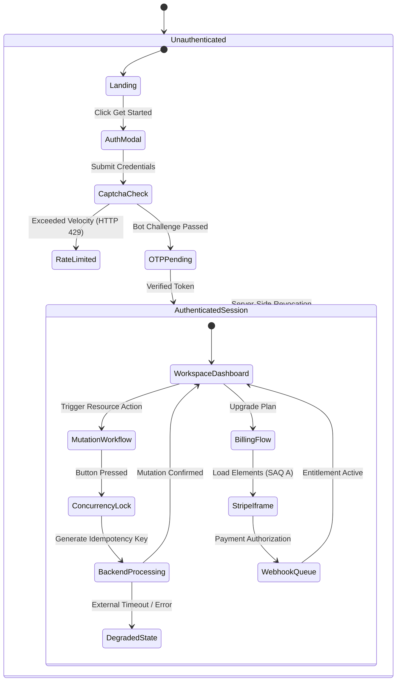

# Application Flow & State Machine Specification
# Project: Enterprise Application

## 1. High-Level User Journey Diagram

## 2. Route & State Transitions Matrix
| Source Route | Trigger Event | Guard / Verification | Destination Route |
| :--- | :--- | :--- | :--- |
| `/` (Landing) | Click "Login" | None | `/login` |
| `/login` | Submit Email | Velocity cap + Turnstile token check | `/auth/verify` (HTTP 200) or HTTP 429 |
| `/auth/verify` | Submit OTP | Match OTP; set httpOnly secure cookie | `/dashboard` |
| `/dashboard` | Submit Resource Mutation | Tenant verification + Idempotency check | `/dashboard` (Cache revalidated) |
| `/billing` | Click "Checkout" | CSRF token + Valid active session | Stripe Checkout Hosted Iframe |
| `/api/webhooks/stripe` | Inbound Event | Raw body cryptographic HMAC signature | HTTP 200 + Enqueue background job |
